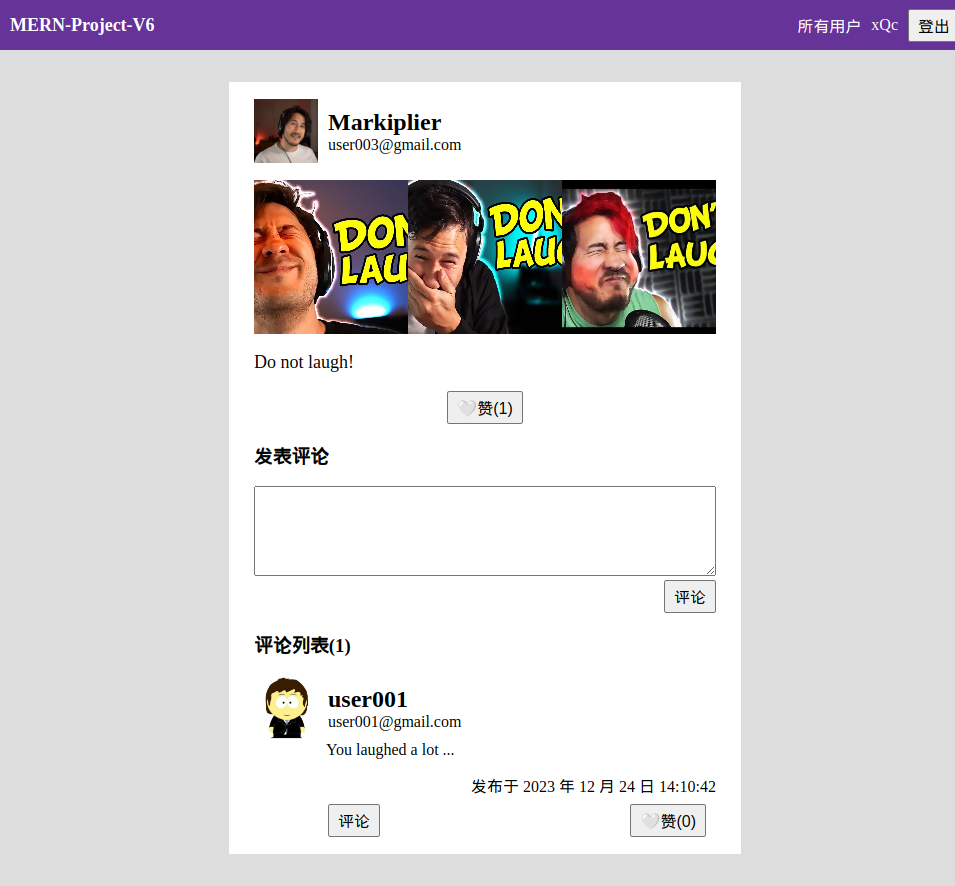

# MERN-Project-V6

使用 MongoDB、Express、React 在 Node 平台上开发。

## 截图

### 个人信息页面(个人视角)

### 个人信息页面(他人视角)

### 个人动态页面(个人视角)

### 个人动态页面(他人视角)

### 个人视频页面(个人视角)

### 个人视频页面(他人视角)

### 动态页面(个人视角)

### 动态页面(他人视角)

### 视频页面(个人视角)

### 视频页面(他人视角)

## 备注

`@hot-loader/react-dom` 应该使用 `16.13.0` 版本，而非 `^17.0.2` 版本。后者在 styled-components 中代码改动时无法触发 hot reloading。
